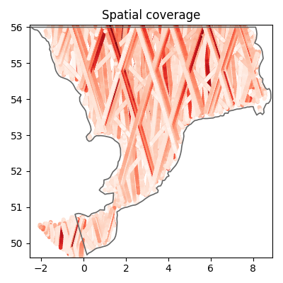

# Spectral wave model of the Southern North Sea

This README provides practical and background information on the dataset. The dataset can be cited as:

> DHI. (2025). Spectral wave model of the Southern North Sea: MIKE 21 SW model setup, outputs and observation data (1.0) [Data set]. Zenodo. [TODO:INSERT LINK](LINK)

See the [license](license.txt) for details on data usage.

## Intended use

This dataset is designed to support educational, research, and exploratory activities, including:

* Experimenting with coastal and ocean modeling using MIKE 21 SW.
* Validating spectral wave model outputs with observational data.
* Developing methods for automatic model parameter calibration.
* Building data-driven models, including machine learning surrogates of MIKE simulation results.

## Folder structure

The repository is organized in the following way

- .preprocessing
    + Jupyter notebooks downloading observation data
    + Jupyter notebooks preprocessing observation data
    + station txt files
- code
    + Jupyter notebooks exploring the dataset
    + Jupyter notebooks for model validation using observations
    + a requirements file (.txt)
- figures
    + figures generated by notebooks
- model
    + MIKE SW model setup file (.sw)
    + log file (.log)
- observations
    + csv files containing observational data for model validation
- output_sample
    + a reduced MIKE model result data file (.dfsu and .dfs0)
- README.md

Separately from the current repository, you can find the output zip file (in Zenodo):

- input
    + Boundary conditions, wind input and MIKE HD model result data (.dfsu and .dfs2)
- output
    + MIKE model result data (.dfsu and .dfs0)

## Introduction

This folder contains data for a MIKE 21 Spectral Wave Model flexible mesh simulation in the southern part of the North Sea. The model domain spans from the English Channel along the southern and eastern English coast, part of the northern French coast, and the coasts of Belgium, the Netherlands, northwest Germany, and southwest Denmark.

The dataset covers the period 2022-01-01 to 2022-12-31. Since the simulation includes a spin-up period, it is recommended to discard the first two days of result data for analysis.

## The MIKE 21 Spectral Wave Module

MIKE 21 Flow Model FM is a modelling system based on a flexible mesh approach. The modelling system has been developed for applications within oceanographic, coastal and estuarine environments. The governing equation is the wave action balance equation formulated in either Cartesian or spherical coordinates. More information can be found [in the documentation](https://manuals.mikepoweredbydhi.help/latest/Coast_and_Sea/M21SW_Scientific_Doc.pdf).

The mesh consists of triangular elements, with higher resolution in areas of interest. For each mesh node, a depth value is assigned by interpolating bathymetric data. The mesh is shown in the figure below and consists of approximately 8000 elements covering an area of about 24.000 $km^2$.

A simulation can be performed with the [MIKE modelling software](https://www.dhigroup.com/technologies/mikepoweredbydhi), while supplying the following data for driving the model:

- the water levels and current velocities on the North boundary
- the water levels and current velocities on the South boundary
- wind velocities in the domain.

The model outputs are provided both as point timeseries (dfs0) and as time-varying full-domain results (dfsu) including the variables in the table below.

| Item | Variable | Unit |
| ------------- | ------------- | ------------- |
| 0 | Significant wave height | meter  |
| 1 | Peak wave period | second |
| 2 | Wave period, T02 | second |
| 3 | Mean wave direction   | degree |
| 4 | x-comp. of wave height vector | meter per sec |
| 5 | y-comp. of wave height vector | meter per sec |
| 6 | Wind speed | meter per sec |
| 7 | Wind direction | degree |

These results are provided as a separate file on [TODO: Zenodo link]()

Running the MIKE software requires a license. Read more about [obtaining a license](https://www.dhigroup.com/technologies/mikepoweredbydhi/pricing) and about [academic licensing](https://www.dhigroup.com/technologies/mikepoweredbydhi/pricing/academic-licenses). If you already have a license, read the [step-by-step guide](https://manuals.mikepoweredbydhi.help/latest/Coast_and_Sea/MIKE_FM_HD_Step_By_Step.pdf) to learn how to run simulations.

## Model validation

The [ModelSkill Python package](https://dhi.github.io/modelskill/) developed at DHI can be used to validate model outputs by comparing them to observational data.

In this case, the model is validated using both in-situ measurements from stations in the Southern North Sea and satellite altimetry data. This validation is performed in the Jupyter notebooks located at `code/model_validation_*.ipynb`. The leftmost figure below shows the location of the measurement stations, while the rightmost figure shows the spatial coverage of the altimetry data.

Below is an example comparison between observational data from a measurement station and the MIKE 21 simulation, followed by a comparison with satellite altimetry data. Many more similar plots can be found in the validation notebooks `code/model_validation_*.ipynb`.

## Data sources

## Other stuff

Copernicus Marine: Download data from dashboard: https://marineinsitu.eu/dashboard/
Copernicus Marine In Situ TAC: Physical parameters list: https://archimer.ifremer.fr/doc/00422/53381/108477.pdf

Stations:

| First Header  | Second Header |
| ------------- | ------------- |
| Content Cell  | Content Cell  |
| Content Cell  | Content Cell  |

