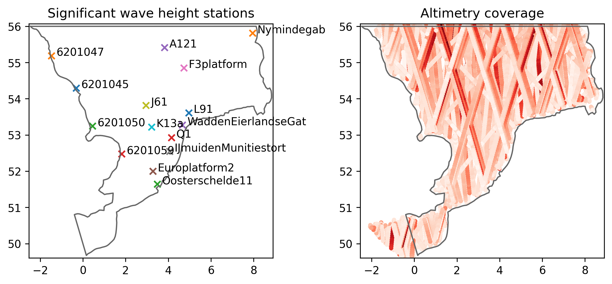
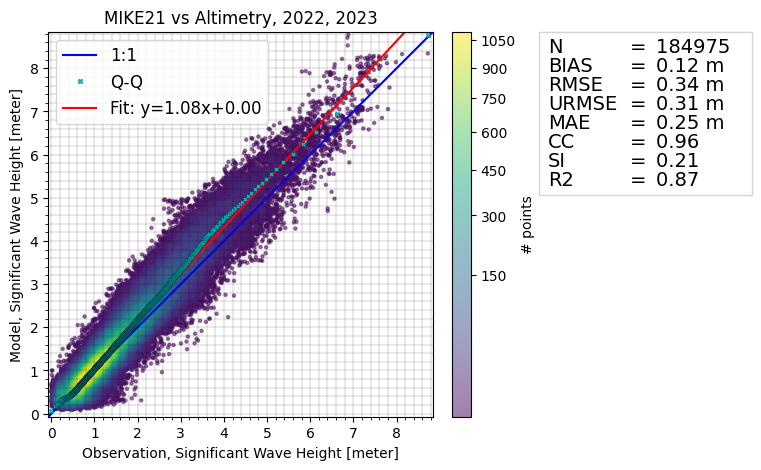

# Spectral wave model of the Southern North Sea
This README provides practical and background information on the dataset. The dataset can be cited as:

> DHI. (2025). Spectral wave model of the Southern North Sea: MIKE 21 SW model setup, outputs and observation data (1.0) [Data set]. Zenodo. [https://doi.org/10.5281/zenodo.17099654](https://doi.org/10.5281/zenodo.17099654)

See the [license](license.txt) for details on data usage.

> ⚠️ **Important Disclaimer**  
> This model setup is a **highly simplified version** of a hindcast model developed by DHI. The mesh has been reduced from over **150,000** to approximately **8,000 elements**, and input data is coarser in both time and space. As a result, model accuracy is significantly lower.
>  
> This model is **not calibrated** for operational use. It is intended for **educational and research purposes only**, and the results **must not** be used for decision-making. The performance shown here does **not** reflect that of DHI’s high-resolution models.

## Intended use

This dataset is designed to support educational, research, and exploratory activities, including:

* Experimenting with coastal and ocean modeling using MIKE 21 SW.
* Validating spectral wave model outputs with observational data.
* Developing methods for automatic model parameter calibration.
* Building data-driven models, including machine learning surrogates of MIKE simulation results.

## Folder structure

The repository is organized in the following way

- README.md
- licence
- model
    + MIKE SW model setup file (.sw)
    + log file (.log)
- input
    + meteorological forcing (wind)
    + boundary conditions (spectral wave energy density)
    + mesh file (.mesh)
- observations
    + csv files containing observational data for model validation
- code
    + Jupyter notebooks exploring the dataset
    + Jupyter notebooks for model validation using observations
    + a requirements file (.txt)
- figures
    + figures generated by notebooks
- output_sample
    + a reduced MIKE model result data file (.dfsu and .dfs0)

Separately from the current repository, you can find the output zip file (in Zenodo):

- output
    + MIKE model result data (.dfsu and .dfs0)

## Introduction

This folder contains data for a MIKE 21 Spectral Wave Model flexible mesh simulation in the southern part of the North Sea. The model domain spans from the English Channel along the southern and eastern English coast, part of the northern French coast, and the coasts of Belgium, the Netherlands, northwest Germany, and southwest Denmark.

This model setup and dataset represent a simplified version of the work performed by DHI for the Rijksdienst voor Ondernemend Nederland (RVO). In that work, DHI provides metocean condition predictions for the IJmuiden Ver (IJB) Offshore Wind Farm Zone. More details are available in the [blogpost here](https://www.dhigroup.com/projects/supporting-successful-dutch-offshore-wind-power-development) or the [scientific report](https://offshorewind.rvo.nl/file/download/bfa49f34-f894-4562-882f-eb1a8b7497e9/ijv_20231222-dhi-metocean-modelling.pdf). 

This repository includes 

* Model setup files, input data, and observation data.
* Simulation result, wind input data, and the hydrodynamic area input file are available on Zenodo [https://doi.org/10.5281/zenodo.17099654](https://doi.org/10.5281/zenodo.17099654).

The dataset covers the period 2022-01-01 to 2023-12-31. Since the simulation includes a spin-up period, it is recommended to discard the first two days of result data for analysis.

## The MIKE 21 Spectral Wave Model

MIKE 21 Flow Model FM is a modelling system based on a flexible mesh approach. The modelling system has been developed for applications within oceanographic, coastal and estuarine environments. The governing equation is the wave action balance equation formulated in either Cartesian or spherical coordinates. More information can be found [in the documentation](https://manuals.mikepoweredbydhi.help/latest/Coast_and_Sea/M21SW_Scientific_Doc.pdf).

The mesh consists of triangular elements, with higher resolution in areas of interest. For each mesh node, a depth value is assigned by interpolating bathymetric data. The mesh is shown in the figure below and consists of approximately 8000 elements covering an area of about 24.000 $km^2$.

A simulation can be performed with the [MIKE modelling software](https://www.dhigroup.com/technologies/mikepoweredbydhi), while supplying the following data for driving the model:

- the spectral wave energy density on the North boundary
- the spectral wave energy density on the South boundary
- the water level and currents in the domain
- wind velocities in the domain.

This input data can be found in the [/input](/input) folder. Model parameters, e.g. bed resistance constant, can be calibrated by comparing the model simulations to observational data. 

The model outputs are provided both as point timeseries (dfs0) and as time-varying full-domain results (dfsu) including the variables in the table below.

| Item | Variable | Unit |
| ------------- | ------------- | ------------- |
| 0 | Significant wave height | meter  |
| 1 | Peak wave period | second |
| 2 | Wave period, T02 | second |
| 3 | Mean wave direction   | degree |

These results are provided as a separate file on [Zenodo](https://doi.org/10.5281/zenodo.17099654). After running a simulation, a log file is generated. For the benchmark simulation, this log file is available in the [/model](/model) folder and contains details on parameter settings and runtime.

Running the MIKE software requires a license. Read more about [obtaining a license](https://www.dhigroup.com/technologies/mikepoweredbydhi/pricing) and about [academic licensing](https://www.dhigroup.com/technologies/mikepoweredbydhi/pricing/academic-licenses). If you already have a license, read the [step-by-step guide](https://manuals.mikepoweredbydhi.help/latest/Coast_and_Sea/MIKE_FM_HD_Step_By_Step.pdf) to learn how to run simulations.

The input and output data are given as dfs files, which can be processed using the [MIKE IO](https://dhi.github.io/mikeio/) Python package developed by DHI. 

## Model validation

The [ModelSkill Python package](https://dhi.github.io/modelskill/) developed at DHI can be used to validate model outputs by comparing them to observational data.

In this case, the model is validated using both in-situ measurements from stations in the Southern North Sea and satellite altimetry data. This validation is performed in the Jupyter notebooks located at `code/model_validation_*.ipynb`. The leftmost figure below shows the location of the measurement stations, while the rightmost figure shows the spatial coverage of the altimetry data.

Below is an example comparison between observational data from a measurement station and the MIKE 21 simulation, followed by a comparison with satellite altimetry data. Many more similar plots can be found in the validation notebooks `code/model_validation_*.ipynb`.

## Data sources

- **Altimetry data**: Only data points marked as "good" by quality flags are included.

## Other stuff

Copernicus Marine: Download data from dashboard: https://marineinsitu.eu/dashboard/
Copernicus Marine In Situ TAC: Physical parameters list: https://archimer.ifremer.fr/doc/00422/53381/108477.pdf

Stations:

| First Header  | Second Header |
| ------------- | ------------- |
| Content Cell  | Content Cell  |
| Content Cell  | Content Cell  |

